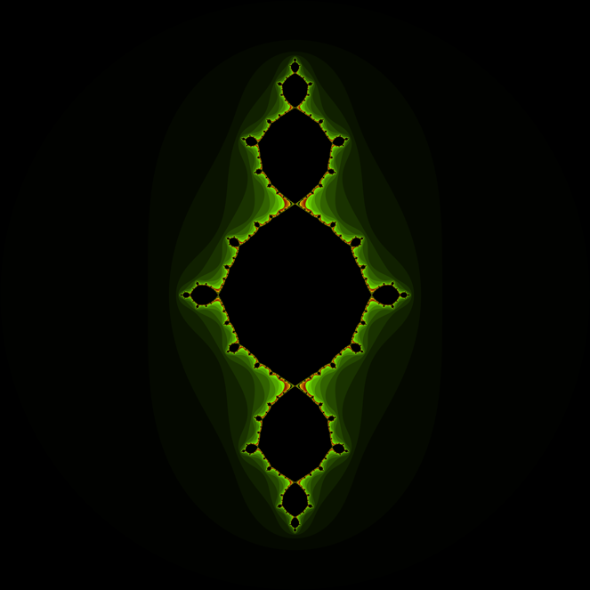
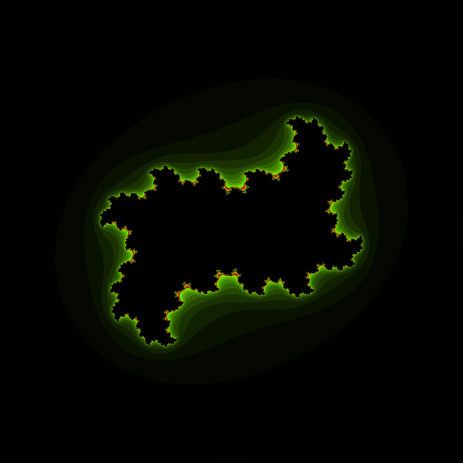
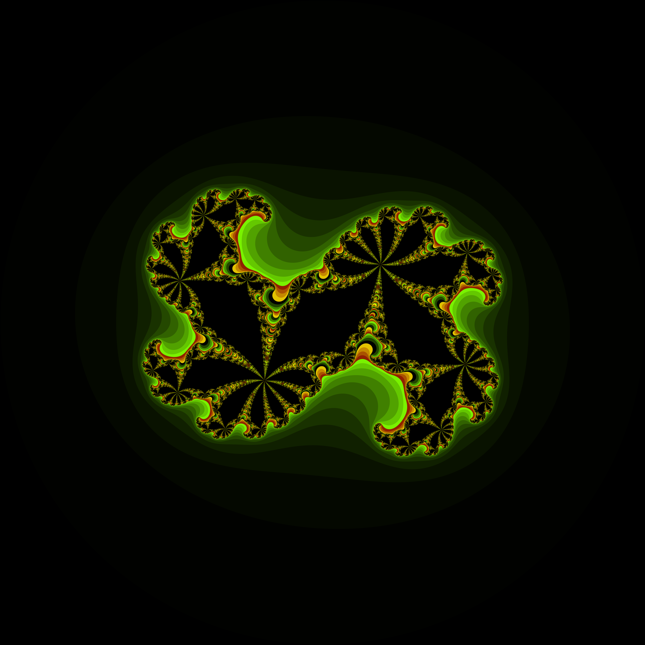
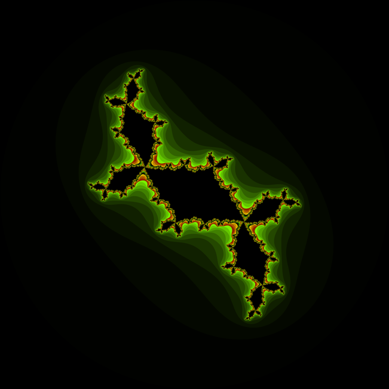
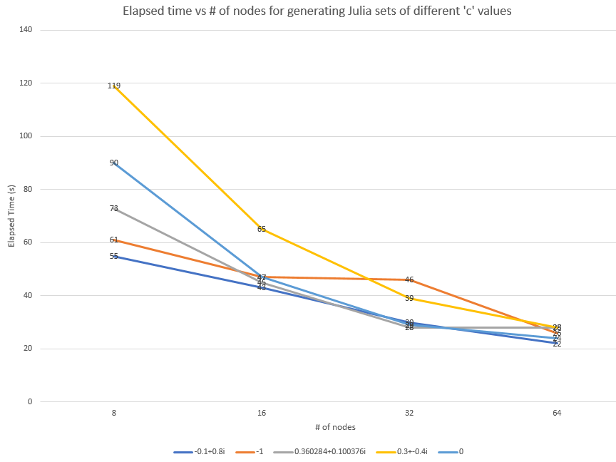

## MPI Programming for Julia Sets

I.Kotsireas

CP431 Final Term Project

YL-BS-LZ-ML

# Introduction

Julia sets were discovered in the early twentieth century by a French Mathematician Gaston Julia, who discovered many of the basic properties of the set. Given a constant complex number c, consider f(z) = z^2+c.
For a starting complex z, the resulting sequence of complex numbers (z, f(z), f(f(z)), f(f(f(z))) …… ) will contains the following possible behaviors.
1. Converges to 0, then z is called a prisoner
2. Diverges to infinity, then z is called an escapee
3. Oscillates among several states
4. Exhibits no discernible pattern.

Then a Julia set for c is the set of points z, whose corresponding series neither converge to 0 nor diverge to infinity. A Julia set of a polynomial is that it is the boundary of the set of points that escape to infinity.

The term project uses C/MPI routines to compute Julia sets and produce high-resolution pictures to the corresponding points. We also used Open GL to render the pictures, and have assigned different colors to the different escape times.

# Algorithm

Our algorithm is based on a pie/pizza division scheme. In other words, instead of using the typical slave-master algorithm that is usually used to divide work when generating Julia sets, we decided to divide the work by slices, hopefully reducing the amount of overhead work. Another reason as to why we decided to use a pie slice mechanism is that as you approach closer to the middle of the Julia sets, the calculations get more intensives, so as to evenly divide the center of the generated image, pie slices seem like an ideal solution.

Once the slices are distinguished, we recognize the upper and lower walls to find what each processor needs to generate; once the walls are distinguished, the process will then generate the image between the two walls.

The resulting image is then sent out in a bitmap file (.data) compressed using a pattern scheme.

 In example if our resulting Julia set generates 000111113,

 Our file is then compressed into 305113

 3 \* 0; 5\*1; 1\*3

# Challenges

OpenGL is a difficulty, we currently output our files in a bit map file (.data), unfortunately none of our teammates have experience with graphics, so implementing OpenGL has, and still is a challenge to overcome.  We currently have a png generator that can read the bitmap file and generate our Julia set images to confirm that our initial algorithm is correct.

As you noticed above, we used a compression algorithm for our output. The reason for using a compression algorithm is that while scaling to higher resolution images we started running into RAM issues (insufficient RAM).

 In example, while generating a 100,000 by 100,000 image, the uncompressed data was around 10GB of memory, whereas the compressed data was only 80MB.

# Results

Results generated from pg.91 of Chaos, fractals and dynamics. Computer experiments in mathematics by Robert L. Devaney. These images were generated using the PNG generator.

**Test/benchmark cases:**

Oval (c=0)

 

| C = -1 | C=0.3-0.4i |
| --- | --- |
|  |  |

| C = 0.360284+0.100376i | C=-0.1+0.8i |
| --- | --- |
|  |  |

Here is our current performance in generating our Julia Sets. (Time in s)

| # of processors | 8 | 16 | 32 | 64 |
| --- | --- | --- | --- | --- |
| -0.1+0.8i | 55 | 43 | 30 | 22 |
| -1 | 61 | 47 | 46 | 26 |
| 0.360284+0.100376i | 73 | 45 | 28 | 28 |
| 0.3+-0.4i | 119 | 65 | 39 | 28 |
| 0 | 90 | 47 | 29 | 24 |
|     |   |   |   |   |

 

# Bibliography

1. Bourke, P. (2001, June). Julia Set Fractal (2D). Retrieved November 30, 2017, from [http://paulbourke.net/fractals/juliaset/](http://paulbourke.net/fractals/juliaset/)
2. Joyce, D. E. (1994, August). Julia and Mandelbrot Sets. Retrieved November 30, 2017, from [https://mathcs.clarku.edu/~djoyce/julia/julia.html](https://mathcs.clarku.edu/~djoyce/julia/julia.html)
3. Sims, K. (n.d.). Understanding Julia and Mandelbrot Sets. Retrieved November 30, 2017, from [http://www.karlsims.com/julia.html](https://l.messenger.com/l.php?u=http%3A%2F%2Fwww.karlsims.com%2Fjulia.html&amp;h=ATMCI0tpeG7j_M_WtRXwkdBFNE6E4Z2Kv8qdLBNhku0kKLHWMNwxku7VOeIbuYCCdhAKU9xO26TvB0793aEhhPsJnO1lMZse_kMxPhB2J0keKtJwnLrVLZIYgsv6-w8dqBK1MAe12TfTkp2lx_VXmiEWMJ1iADiYU6g)
4. Chaos, fractals, and dynamics: computer experiments in mathematics. Menlo Park, Calif.: Addison-Wesley.
